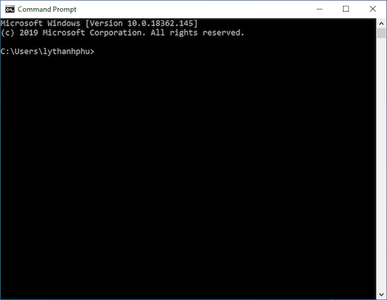
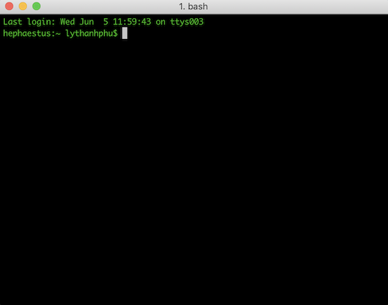
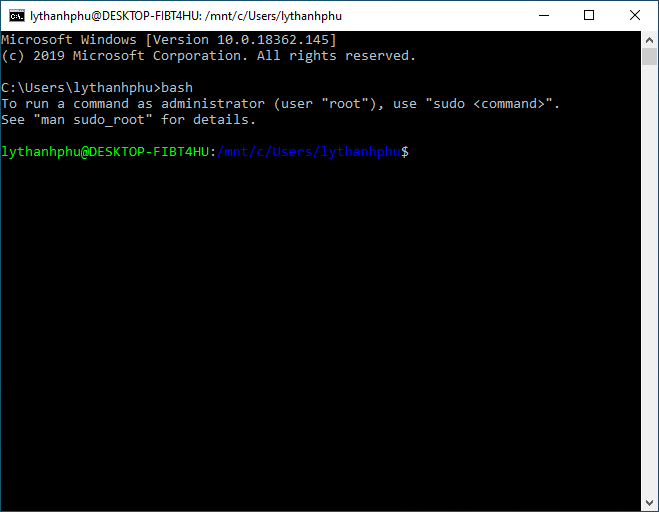
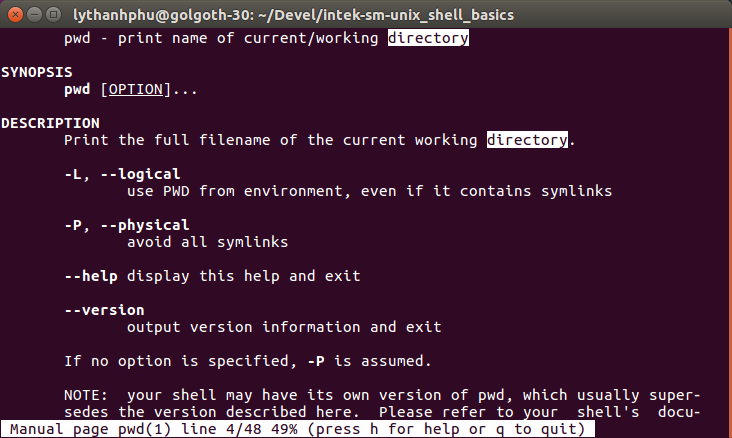
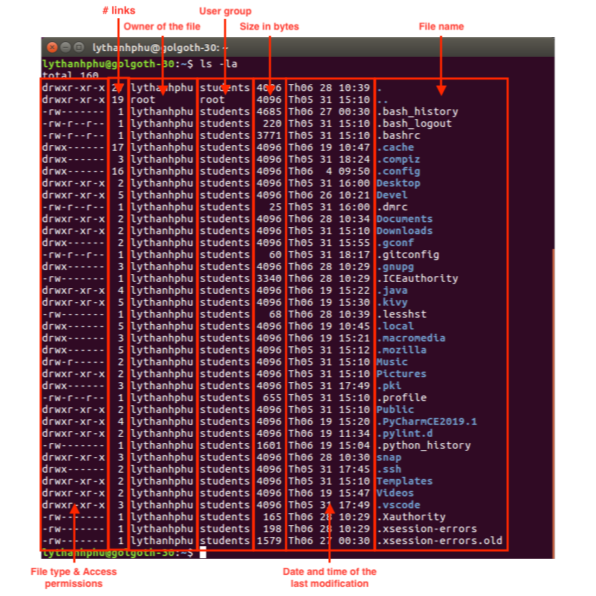
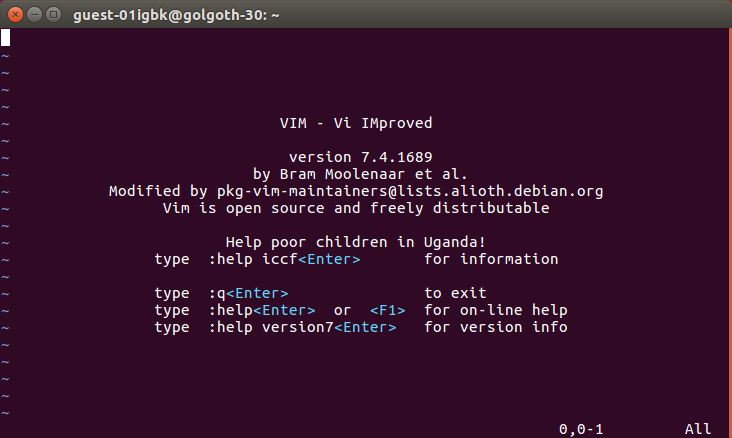

# Giới thiệu về Shell (cách đọc tốt nhất là HÃY nhấp vào mọi link tham khảo, vì nó đã được chọn lọc  nhé !, hãy chờ 5s và nhấn bỏ qua nhé !)
(neu ban khong co ubuntu hay download ban ubuntu ve window xai tam)


Hacker thực thụ không dùng chuột và [Graphical User Interface (GUI)](http://raboninco.com/1JlDF) (Giao diện đồ họa người dùng) để kiểm soát máy tính. Họ dùng bàn phím và [Command-Line Interface (CLI)](http://raboninco.com/1JlEf) (Giao diện dòng lệnh): đó là một **terminal emulator** (chương trình giả lập thiết bị đầu cuối) sử dụng ứng dụng **shell**.

## Terminal

Một [terminal emulator](http://raboninco.com/1JlFq), gọi tắt là _terminal_, là một ứng dụng cung cấp giao diện dòng lệnh giúp kết nối người dùng với hệ điều hành. Terminal xử lý các văn bản thông qua các ký tự (_character-based_) được người dùng nhập từ bàn phím và hiển thị thành dạng văn bản trong cửa sổ giao diện. Terminal dùng **shell**, một ứng dụng đặc thù, để diễn dịch các lệnh mà người dùng đã gõ vào.

Có rất nhiều ứng dụng [terminal dành cho Windows, Mac OS X và Linux](http://raboninco.com/1JlMw). Ví dụ:

| [Windows: Command Prompt](http://raboninco.com/1JlNz)     | [Mac OS X: iTerm2](http://raboninco.com/1JlOl) | [Linux: GNOME Terminal](http://raboninco.com/1JlSQ)                    |
| -------------------------------------------------------------------- | -------------------------------------------------------- | ---------------------------------------------------------------------------------------- |
|  |          |  |

## Shell

[Shell](<https://en.wikipedia.org/wiki/Shell_(computing)>) là một ứng dụng cho phép bạn gõ lệnh kèm theo các thuộc tính, rồi nhấn phím `Enter`/`Return` để chạy lệnh đó. Shell sẽ xử lý lệnh rồi trả ra kết quả tương ứng. Sau đó, bạn có thể nhập tiếp lệnh mới. Shell hỗ trợ rất nhiều tính năng như chạy tập tin script (tập tin văn lệnh), chạy lệnh ngầm, kết nối các lệnh để tạo ra lệnh chuỗi, v.v.


Một trong những ứng dụng shell rất thông dụng dành cho các hệ điều hành Unix là [`bash`](<https://en.wikipedia.org/wiki/Bash_(Unix_shell)>). Ngoài `bash`, bạn cũng có thể cài đặt một số [ứng dụng shell](http://raboninco.com/1KFXy) khác cho hệ điều hành.

Vấn đề là mỗi shell sẽ sử dụng công cụ biên dịch lệnh riêng, với các cú pháp lệnh khác nhau tương ứng với các cấp độ lập trình khác nhau. Ví dụ, nếu muốn biết danh sách các tập tin trong một thư mục, bạn sẽ gõ lệnh `dir` trong `Command Prompt` dùng cho Windows, nhưng lại gõ lệnh `ls` trong `bash` dùng cho các hệ điều hành Unix.

## POSIX Shell

[POSIX](http://raboninco.com/1KFZY) là một [chuẩn shell](http://raboninco.com/1KFbr) mà hầu hết các shell dùng cho các hệ điều hành Unix đều tuân theo. POSIX giúp cho việc phát triển các phần mềm có khả năng tương thích với nhiều hệ thống trở nên dễ dàng hơn.

Bạn sẽ dùng POSIX shell để thực hiện nhiệm vụ này.

_Lưu ý: ứng dụng shell mặc định của Windows, `Command Prompt` terminal không tuân theo chuẩn POSIX. Bạn KHÔNG THỂ dùng `Command Prompt` để thực hiện nhiệm vụ này. May mắn thay, nhờ có Ubuntu, các dòng lệnh Linux sẽ có thể dùng được trên Windows - [Linux command-line comes to Windows](http://raboninco.com/1KFkI). Bạn CẦN cài đặt [Windows System for Linux (WSL)](http://raboninco.com/1KFf8) và một phiên bản của Linux như [Ubuntu](http://raboninco.com/1KFiq). Sau khi cài đặt, bạn có thể khởi chạy `Command Prompt` và gõ lệnh `bash` để chạy Bash shell:_



# Làm cách nào để...? Đi mà đọc tài liệu hướng dẫn! (Read The F\*\*king Manual)

 

_"Nếu bạn có thời gian để hỏi, hãy dành thời gian để học thêm nữa; thời gian của tôi rất quý báu, hãy tôn trọng nó."_

[RTFM](http://raboninco.com/1KFm1) là một câu trả lời rất hay được dùng trong các forums hoặc mailing lists (email làm việc nhóm), khi một thành viên mới đặt một câu hỏi mà câu trả lời đã có sẵn trong tài liệu hướng dẫn.

Người trả lời câu "RTFM" có thể bị xem là sỗ sàng, nhưng người thực sự bất lịch sự chính là người làm phiền người khác mà không chịu tự tìm hiểu và nghĩ rằng người khác luôn sẵn sàng trả lời mọi câu hỏi cho mình.

```text
noob: Làm thế nào để tạo cây thư mục "./a/b/c/d" bằng lệnh "mkdir"?
1337: Vậy luôn, vậy mà cũng hỏi sao... RTFM thưa "ngài mkdir"!!!
```

Hãy luôn thử tìm câu trả lời cho những câu hỏi cơ bản như vậy bằng các cách như tìm trên [Google](https://www.google.com/) hoặc [Stack Overflow](https://stackoverflow.com/), hoặc đọc tài liệu.

Ví dụ, đừng bao giờ đặt câu hỏi kiểu một lệnh nào đó trong Unix shell chạy như thế nào mà không tự tìm hiểu trước. Trên trang hướng dẫn [`man` page](http://raboninco.com/1KFpn) có lẽ đã có [tài liệu hướng dẫn về lệnh đó](http://raboninco.com/1KFqq) với đầy đủ các arguments - tham số mà lệnh đó hỗ trợ.

Để gọi `man` page, từ cửa sổ terminal, hãy gõ lệnh `man` và tên lệnh mà bạn muốn tìm hiểu. Ví dụ, bạn muốn tìm hiểu cách dùng lệnh `pwd`:

```bash
$ man pwd
```

Kết quả sau đây sẽ hiển thị trên màn hình:

```bash
PWD(1)                                     User Commands                                    PWD(1)

NAME
       pwd - print name of current/working directory

SYNOPSIS
       pwd [OPTION]...

DESCRIPTION
       Print the full filename of the current working directory.

       -L, --logical
              use PWD from environment, even if it contains symlinks

       -P, --physical
              avoid all symlinks

       --help display this help and exit

       --version
              output version information and exit

       If no option is specified, -P is assumed.

       NOTE:  your  shell  may  have  its own version of pwd, which usually supersedes the version
       described here.  Please refer to your shell's documentation for details about  the  options
       it supports.

AUTHOR
       Written by Jim Meyering.

REPORTING BUGS
       GNU coreutils online help: <http://www.gnu.org/software/coreutils/>
       Report pwd translation bugs to <http://translationproject.org/team/>

COPYRIGHT
       Copyright © 2016 Free Software Foundation, Inc.  License GPLv3+: GNU GPL version 3 or later
       <http://gnu.org/licenses/gpl.html>.
       This is free software: you are free to change and redistribute it.  There is  NO  WARRANTY,
       to the extent permitted by law.

SEE ALSO
       getcwd(3)

       Full documentation at: <http://www.gnu.org/software/coreutils/pwd>
       or available locally via: info '(coreutils) pwd invocation'

GNU coreutils 8.25                         February 2017                                    PWD(1)
```

Để thoát khỏi trang hướng dẫn, chỉ cần nhấn phím `q`.

Nếu bạn cần tìm một từ nào đó trong trang hướng dẫn, nhấn phím `/` và gõ từ bạn cần tìm, rồi nhấn phím `Return`:

|                                                     |                                               |
| --------------------------------------------------- | --------------------------------------------- |
|  |  |

# Giới thiệu về File System (hệ thống tập tin)

Hệ thống tập tin [**file system**](http://raboninco.com/1KFzs) là một cơ chế giúp lưu trữ thông tin trên một phương tiện lưu trữ nào đó, ví dụ: ổ cứng, bằng cách sắp xếp các tập tin theo một hệ thống các thư mục.

## File (tập tin)

File system bao gồm nhiều files. Một [**file**](http://raboninco.com/1KG17) thực chất là một dãy các [bytes](http://raboninco.com/1KG1k).

Ví dụ, nội dung của file [`README.md`](./README.md) bắt đầu bằng đoạn văn bản sau (văn bản là một chuỗi các ký tự):

```md
# Introduction to The Shell


Real hackers don't use a mouse and a [Graphical User Interface (GUI)](https://en.wikipedia.org/wiki/Graphical_user_interface) applications to control a computer. They use a keyboard and a [Command-Line Interface (CLI)](https://en.wikipedia.org/wiki/Command-line_interface): a **terminal emulator** with a **shell** application.
```

Nội dung trên thực chất là một dãy các bytes theo hệ thập lục phân (hệ đếm cơ số 16) - [hexadecimal](http://raboninco.com/1KG3r), hay còn gọi là [hex dump](http://raboninco.com/1KG4u), mà bạn nhìn thấy dưới đây:

```hex
00000000  23 20 49 6e 74 72 6f 64  75 63 74 69 6f 6e 20 74  |# Introduction t|
00000010  6f 20 54 68 65 20 53 68  65 6c 6c 0a 0a 21 5b 54  |o The Shell....Real hacker|
00000050  73 20 64 6f 6e 27 74 20  75 73 65 20 61 20 6d 6f  |s don't use a mo|
00000060  75 73 65 20 61 6e 64 20  61 20 5b 47 72 61 70 68  |use and a [Graph|
00000070  69 63 61 6c 20 55 73 65  72 20 49 6e 74 65 72 66  |ical User Interf|
00000080  61 63 65 20 28 47 55 49  29 5d 28 68 74 74 70 73  |ace (GUI)](https|
00000090  3a 2f 2f 65 6e 2e 77 69  6b 69 70 65 64 69 61 2e  |://en.wikipedia.|
000000a0  6f 72 67 2f 77 69 6b 69  2f 47 72 61 70 68 69 63  |org/wiki/Graphic|
000000b0  61 6c 5f 75 73 65 72 5f  69 6e 74 65 72 66 61 63  |al_user_interfac|
000000c0  65 29 20 61 70 70 6c 69  63 61 74 69 6f 6e 73 20  |e) applications |
000000d0  74 6f 20 63 6f 6e 74 72  6f 6c 20 61 20 63 6f 6d  |to control a com|
000000e0  70 75 74 65 72 2e 20 54  68 65 79 20 75 73 65 20  |puter. They use |
000000f0  61 20 6b 65 79 62 6f 61  72 64 20 61 6e 64 20 61  |a keyboard and a|
00000100  20 5b 43 6f 6d 6d 61 6e  64 2d 4c 69 6e 65 20 49  | [Command-Line I|
00000110  6e 74 65 72 66 61 63 65  20 28 43 4c 49 29 5d 28  |nterface (CLI)](|
00000120  68 74 74 70 73 3a 2f 2f  65 6e 2e 77 69 6b 69 70  |https://en.wikip|
00000130  65 64 69 61 2e 6f 72 67  2f 77 69 6b 69 2f 43 6f  |edia.org/wiki/Co|
00000140  6d 6d 61 6e 64 2d 6c 69  6e 65 5f 69 6e 74 65 72  |mmand-line_inter|
00000150  66 61 63 65 29 3a 20 61  20 2a 2a 74 65 72 6d 69  |face): a **termi|
00000160  6e 61 6c 20 65 6d 75 6c  61 74 6f 72 2a 2a 20 77  |nal emulator** w|
00000170  69 74 68 20 61 20 2a 2a  73 68 65 6c 6c 2a 2a 20  |ith a **shell** |
00000180  61 70 70 6c 69 63 61 74  69 6f 6e 2e 0a 0a 23 23  |application...##|
```

## Directories (Folders - Thư mục)

File system (hệ thống tập tin) của các hệ Unix là một hệ thống phân theo cấp bậc (cấu trúc cây).

[**Directories**](<https://en.wikipedia.org/wiki/Directory_(computing)>) (Các thư mục) đóng vai trò quan trọng trong các file systems đi theo hệ thống cấp bậc. Các thư mục cho phép chúng ta tập hợp các thư mục và các tập tin lại thành nhóm, từ đó sắp xếp và biến file system thành một hệ thống cấp bậc theo mô đun. Hệ thống cấp bậc này giúp cấu trúc của file system trở nên linh động và có độ sâu, đồng thời giúp dễ dàng tìm kiếm dữ liệu và giúp việc lưu trữ trở nên mạnh mẽ hơn.

Thư mục cao nhất trong hệ thống cấp bậc này là **root directory** (thư mục gốc), là thư mục duy nhất trong hệ điều hành dựa trên Unix chứa hết tất cả các thư mục còn lại và được thể hiện bằng kí tự **`/`**

Mỗi thư mục, ngoài **root directory** (thư mục gốc), đều có một **parent directory** (thư mục cha, thư mục trực tiếp "phía trên"). Bất kì thư mục nào đều có thể có nhiều **child directories**, **subdirectories** (thư mục con). Mọi thư mục đều được xem là thư mục con, dĩ nhiên không tính **root directories** - thư mục gốc.

Ví dụ:

```text
/
├── bin
├── home
│   ├── figaro
│   ├── haitac
│   ├── papazark
│   ├── theprophete
│   └── yoda
├── lib
├── tmp
├── usr
│   ├── bin
│   ├── lib
│   └── sbin
└── var
    ├── cache
    ├── log
    ├── mail
    ├── spool
    └── www
```

Trong ví dụ trên, parent directory của thư mục `home` chính là thư mục gốc (`/`). Thư mục `home` có các thư mục con: `figaro`, `haitac`, `papazark`, `theprophete`, và `yoda`.

_Lưu ý: Trong các hệ điều hành Unix, mọi thứ trong hệ thống đều được xem là 1 file (tập tin), và 1 thư mục được xem là 1 loại file đặc biệt mà trong đó chứa danh sách các tên files. Vì thế, có thể xem **directory** như là từ viết tắt của **directory file**._

## Home Directory

Khi bạn mở một [terminal](http://raboninco.com/1JlEf) mới, cửa sổ terminal sẽ hiển thị **command line - dòng lệnh** để người dùng gõ **command - lệnh**. Một lệnh là một chỉ thị yêu cầu máy tính thực hiện một thao tác nào đó, ví dụ: chạy một chương trình.

Thư mục hiện hành của bạn đang là [**home directory**](http://raboninco.com/1KG71). Home directory là thư mục được dùng làm repository để chứa các tập tin, thư mục và chương trình của người dùng.

Ví dụ, nếu username của bạn là `haitac`, home directory của bạn trên Linux sẽ là `/home/haitac`, còn trên Mac OS X sẽ là `/Users/haitac`.

| Ubuntu Desktop 16.04                                                              |
| --------------------------------------------------------------------------------- |
|  |

| Mac OS X                                                 |
| -------------------------------------------------------- |
|  |

| Windows 10                                                    |
| ------------------------------------------------------------- |
|  |

Trên các hệ Unix, home directory thường được biểu thị bằng [**`~`** (tilde)](http://raboninco.com/1KGDG).

Dòng lệnh tắt "`~`" chỉ về home directory mà người dùng đang đăng nhập vào.

Dòng lệnh tắt "`~username`" chỉ về home directory của 1 người dùng nào đó có
`username` tương ứng.

```bash
$ ~
bash: /home/haitac: is a directory
$ ~theprophete
bash: /home/theprophete: is a directory
```

## Current Working Directory (Thư mục làm việc hiện hành)

**Thư mục hiện hành**, còn gọi là [**thư mục làm việc hiện hành (CWD)**](http://raboninco.com/1KGG7), là thư mục mà trong đó người dùng đang làm việc tại một thời điểm xác định. Thực tế, người dùng lúc nào cũng đang làm việc trong một thư mục nào đó.

Lệnh `pwd` sẽ trả về thư mục hiện hành. Ví dụ: nếu username của bạn là `haitac`, trên Linux, lệnh `pwd` sẽ hiển thị kết quả như sau:

```bash
$ pwd
/home/haitac
```

Hoặc như sau, nếu trên Mac OS X:

```bash
$ pwd
/Users/haitac
```

## Directory Listing (truy cập danh mục files và thư mục)

Lệnh `ls` sẽ liệt kê toàn bộ nội dung của một thư mục, mặc định là thư mục hiện hành nếu không có tham số đi kèm.

Ví dụ:

```bash
$ ls
Desktop  Documents  Downloads  Music  Pictures  Public  Templates  Videos
```

Bạn có thể thêm vào tham số `-1` để liệt kê mỗi tập tin trên một dòng, và `-a` để liệt kê cả các thư mục có tên bắt đầu bằng dấu chấm `.` . Bạn có thể gõ `ls -1 -a`, hoặc gõ `ls -1a`.

Ví dụ:

```bash
$ ls -1a
.
..
.bash_history
.bash_logout
.bashrc
.cache
.compiz
.config
Desktop
.dmrc
Documents
Downloads
.gconf
.gitconfig
.gnupg
.ICEauthority
.local
.mozilla
Music
Pictures
.pki
.profile
Public
.ssh
Templates
Videos
.vscode
.Xauthority
.xsession-errors
```

Trong ví dụ trên, bạn thấy 2 dòng đầu tiên hiển thị `.` và `..` . Chúng biểu thị cho 2 loại thư mục:

- Dấu `.` (một chấm đơn) biểu thị cho _current directory_ (thư mục hiện hành).
- Dấu `..` (hai chấm liên tục) biểu thị cho _parent directory_ (thư mục cha).

Nếu bạn đưa thêm tham số `-l`, lệnh `ls` sẽ trả về thêm các thông tin sau cho mỗi file:

- chế độ file
- số lượng link liên kết
- tên "chủ" sở hữu
- tên nhóm
- kích thước file tính theo bytes
- ngày và giờ thay đổi file gần đây nhất
- tên file

Ví dụ:

```bash
$ ls -la
```

trả về kết quả sau:



## File Permissions (quyền hạn truy cập)
(nếu bạn đang sử dụng window thì bạn không thể tạo thư mục và thực hành, macbook có sẵn terminal cứ bật lên xài nhé, cố gắn đọc hiểu nhé!)

Các hệ điều hành Linux đều có hỗ trợ phân quyền - [permissions](<(https://en.wikipedia.org/wiki/File_system_permissions)>).

Phân quyền giúp kiểm soát các quyền **read** (đọc, xem nội dung file hoặc duyệt cây thư mục), **write** (viết, thay đổi nội dung file), và **execute** (thực thi file chương trình) của người dùng.

Các quyền trên được phân cho 3 nhóm người dùng (**classes**): **owner** - chủ sở hữu của file, **group** - nhóm mà owner (chủ sở hữu) đang thuộc về, và all **other** users - toàn bộ những người dùng khác. **Owner** - chủ sở hữu là người đã tạo file. **Group** - nhóm là tập hợp những người dùng có quyền hạn truy cập giống nhau.

Phân quyền trong Unix được có thể biểu thị bằng [symbolic notation](http://raboninco.com/1KGMu) (ký hiệu) hoặc bằng [numeric (octal) notation](http://raboninco.com/1KGg7) (số dạng bát phân).

Bạn dùng lệnh [`chmod`](<https://en.wikipedia.org/wiki/Modes_(Unix)>) để [phân quyền file](http://raboninco.com/1KGbQ) cho từng nhóm (owner, group, others).

### Symbolic Notation (phân quyền dùng ký hiệu)

Ví dụ, bạn có thể phân quyền cho thư mục `Music` bằng cách dùng ký hiệu như sau:

- **read**/**write**/**execute** cho **owner**;
- **read**/**execute** cho **group** của owner;
- **read**/**execute** cho **others**.

```bash
$ ls -lad Music
drwxr-xr-x  2 haitac students 4096 Th05 31 15:10 Music
$ chmod u+rwx Music
$ chmod g+rx Music
$ chmod g-w Music
$ chmod o+rx Music
$ chmod o-w Music
$ ls -lad Music
drwxr-xr-x 2 haitac students 4096 Th05 31 15:10 Music
```

hoặc dùng 1 dòng lệnh duy nhất như sau:

```bash
$ chmod u+rwx,g+rx,g-w,o+rx,o-w Music
```

### Numeric Notation (phân quyền dùng số)

Ví dụ, bạn có thể phân quyền cho thư mục `Music` bằng số như sau:

- **read**/**write**/**execute** cho **owner**;
- **read**/**execute** cho **group** của owner;
- **nothing** cho **others**.

```bash
$ stat -c %a Music
640
$ chmod 750 Music
$ ls -lad Music
drwxr-x---  2 haitac students 4096 Th05 31 15:10 Music
```

_Lưu ý: để có thể phân quyền dùng số với lệnh `chmod`, bạn phải hiểu cách diễn đạt các giá trị bằng số. Bạn có thể nhờ hỗ trợ từ [permissions calculator](http://raboninco.com/1KGgx)._

## Path (đường dẫn)

[**Path**](<https://en.wikipedia.org/wiki/Path_(computing)>) (đường dẫn) cho biết vị trí của file.

Path (đường dẫn) giúp định hình một "con đường", tương ứng với một dãy các thư mục mà ta cần đi theo để có thể truy cập đến một vị trí xác định.

Path (đường dẫn) được biểu thị bằng các ký tự theo dạng chuỗi, trong đó tên của các thư mục được phân cách bằng dấu phân tách. Trong hệ Unix, dấu phân tách được dùng là dấu `/` (slash).

Ví dụ:

```text
/
├── bin
├── home
│   ├── figaro
│   ├── haitac
│   │   ├── Desktop
│   │   ├── Documents
│   │   ├── Downloads
│   │   ├── Library
│   │   ├── Movies
│   │   ├── Music
│   │   ├── Pictures
│   │   └── Public
│   ├── papazark
│   ├── theprophete
│   └── yoda
├── lib
├── tmp
├── usr
└── var
```

Có hai dạng đường dẫn cơ bản: **absolute paths** và **relative paths**.

### Absolute Path (đường dẫn tuyệt đối)

Absolute path - đường dẫn tuyệt đối là đường dẫn có điểm xuất phát từ **root directory** (thư mục gốc).

Ví dụ, đường dẫn tuyệt đối đến thư mục `Music` của `haitac` là `/home/haitac/Music`.

```text
/
└── home
    └── haitac
        └── Music
```

### Relative Path (đường dẫn tương đối)

Relative path - đường dẫn tương đối là đường dẫn có điểm xuất phát từ **thư mục hiện hành**.

Nếu thư mục hiện hành đang là `haitac`, đường dẫn tương đối đến thư mục `Music` của `haitac` là `./Music`, hay ngắn gọn là `Music`:

```text
/
└── home
    └── haitac  <--- This is the current directory "."
        └── Music  <--- This is the location to point to from the current directory
```

Nếu thư mục hiện hành đang là `/home`, đường dẫn tương đối đến thư mục `Music` của `haitac` là `./haitac/Music`, hay ngắn gọn là `haitac/Music`:

```text
/
└── home  <--- This is the current directory "."
    └── haitac
        └── Music  <--- This is the location to point to from the current directory
```

Nếu thư mục hiện hành đang là `/home/theprophete`, đường dẫn tương đối đến thư mục `Music` của `haitac` là `./../haitac/Music`, hay ngắn gọn là `../haitac/Music`.

```text
/
└── home
    ├── haitac
    │   └── Music  <--- This is the location to point to from the current directory
    └── theprophete  <--- This is the current directory "."
```

Bạn có thể cho một đường dẫn tương đối rất phức tạp một cách không cần thiết, khi đi qua nhiều lớp thư mục cha, thư mục con khác nhau để đến vị trí cần đến. Ví dụ, đường dẫn tương đối cho thư mục `Music` từ home directory của `haitac` có thể là `./../yoda/../haitac/Music`. Khi đó, đường đi của cây thư mục sẽ giống như hình bên dưới, trong khi ta chỉ cần để đơn giản là `./Music`, hoặc `Music`:

```text
.                       ..                      yoda                    ..                      haitac              Music

/                       /                       /                       /                       /                       /
└── home                └── home  <--           └── home                └── home  <--           └── home                └── home
    ├── haitac  <--     ├── haitac          ├── haitac          ├── haitac          ├── haitac  <--     ├── haitac
    │   └── Music           │   └── Music           │   └── Music           │   └── Music           │   └── Music           │   └── Music  <--
    └── yoda                └── yoda                └── yoda  <--           └── yoda                └── yoda                └── yoda
```

## Changing Directory (chuyển thư mục)

Lệnh `cd` cho phép bạn chuyển vị trí từ thư mục hiện hành sang một thư mục khác. Bạn có thể cung cấp một đường dẫn tương đối hoặc tuyệt đối để chỉ đến thư mục đích mà bạn muốn chuyển đến.

Ví dụ:

```bash
$ pwd
/home/haitac
$ cd Music
$ pwd
/home/haitac/Music
$ cd ../../theprophete
$ pwd
/home/theprophete
$ cd ~
$ pwd
/home/haitac
$ cd /home/yoda
$ pwd
/home/yoda
```

_Lưu ý: đừng quên parent directory (thư mục cha) được biểu thị bằng dấu "`..`", và home directory (thư mục chính) được biểu thị bằng dấu "`~`" nếu đó là home directory của chính người dùng đang đăng nhập hoặc "`~username`" nếu muốn vào home directory của người dùng khác._

_Lưu ý: lệnh "`cd .`" không chuyển bạn đi đâu cả; bạn vẫn ở trong thư mục hiện hành. Vậy khi nào cần dùng "`.`"? Bạn dùng "`.`" khi muốn cung cấp một đường dẫn tương đối với "`/`", ví dụ: "`./Music`". Nếu bạn chỉ nhập "/Music", máy sẽ hiểu bạn đang cung cấp một đường dẫn tuyệt đối bắt đầu từ `root` directory - thư mục gốc._

## Shell Command Prompt (dấu nhắc lệnh trong Shell)

Command prompt - dấu nhắc dòng lệnh, hay gọt tắt là prompt - dấu nhắc, là một đoạn văn bản ngắn nằm ngay đầu dòng lệnh trong shell.

Dấu nhắc mặc định của _bash_ shell chứa tên của người dùng, tên máy tính và đường dẫn của thư mục hiện hành.

Ví dụ, nếu thư mục hiện hành của người dùng `haitac` là home directory (`~`) của chính bạn ấy, dấu nhắc sẽ trông như sau:

```bash
haitac@golgoth-30:~$
```

Nếu người dùng `haitac` thay đổi từ thư mục hiện hành qua thư mục khác, dấu nhắc sẽ thể hiện sự thay đổi đó:

```bash
haitac@golgoth-30:~$ cd ../theprophete
haitac@golgoth-30:/home/theprophete$
```

Dấu nhắc thường thể hiện đường dẫn tương đối đi từ home directory của người dùng đến thư mục hiện hành nếu thư mục hiện hành là thư mục con, cháu... của home directory, ví dụ `~/Music`.

Dấu nhắc sẽ thể hiện đường dẫn tuyệt đối nếu thư mục hiện hành của người dùng không phải là thư mục con, cháu... của home directory của người dùng, ví dụ: `/home/theprophete`.

Bạn có thể [định dạng lại dấu nhắc của shell](http://raboninco.com/1KGof). Thậm chí có vài websites còn chỉ bạn cách [tùy chỉnh dấu nhắc](http://raboninco.com/1KGpC). Tuy nhiên, việc này không nằm trong nhiệm vụ của chúng ta hôm nay.

## Directory Creation (tạo thư mục)

Lệnh `mkdir` giúp tạo một hay nhiều thư mục với đường dẫn tương ứng với các tham số của lệnh.

Ví dụ:

```
$ pwd
/home/haitac
$ mkdir Devel
$ mkdir ./Music/Classical ./Music/Jazz
$ ls ./Music
Classical	Jazz
```

Đường dẫn đầy đủ của thư mục cần tạo phải tồn tại sẵn. Ví dụ, nếu bạn muốn tạo thư mục "`Hard Rock`" trong thư mục "`Rock`" là con của thư mục "`Music`" - "`./Music/Rock/Hard Rock`", thư mục "`Rock`" phải được tạo trước. Nếu thư mục "`Rock`" không được tạo trước, bạn cần phải thêm tham số `-p` để có thể tạo ngay nhiều thư mục liên tục theo mong muốn:

```bash
$ mkdir "./Music/Rock/Hard Rock"
mkdir: ./Music/Rock: No such file or directory
$ mkdir -p  "./Music/Rock/Hard Rock"
```

```text
./Music/
├── Classical
├── Jazz
└── Rock
    └── Hard\ Rock
```

## Directory Deletion (xóa thư mục)

Lệnh `rmdir` sẽ xóa một hay nhiều thư mục với đường dẫn tương ứng với các tham số của lệnh. Thư mục xóa phải là thư mục rỗng.

```bash
# Create a new directory Foo.
$ mkdir Foo
# Delete this fresh created directory Foo.
$ rmdir Foo
# Try to delete the directory Music that contains files.
$ rmdir Music
rmdir: failed to remove 'Music/': Directory not empty
```

## Text File Creation and Edition (tạo và hiệu chỉnh tập tin văn bản)

### Empty Text File Creation (tạo tập tin văn bản rỗng)

Nếu bạn muốn tạo một file rỗng, bạn có thể dùng lệnh `touch` tiếp nối bằng tên file cần tạo.

Ví dụ:

```bash
$ touch foo.txt
$ ls -la foo.txt
-rw-r--r-- 1 haitac students 0 Th06 26 10:25 foo.txt
```

_Lưu ý: Lệnh `touch` ban đầu được dùng để cập nhật thời gian thay đổi (truy cập) một file đã tạo sẵn._

```bash
$ touch foo.txt
$ ls -la foo.txt
-rw-r--r-- 1 haitac students 0 Th06 26 10:27 foo.txt
```

### Text File Editors (hiệu chỉnh tập tin văn bản)

#### `vi` & `Vim`(không phải tẩy rữa bồn cầu đâu nhé!)
một số máy không có sẵn vim nên các bạn có thể tải hoặc dùng nano nha.
[xem anh toidicodedao su dung vim ne](http://raboninco.com/1KH3E)


[`vi` là một công cụ cho phép hiệu chỉnh và làm việc với văn bản](http://raboninco.com/1KGyE) từ buổi sơ khai của Unix (từ cuối những năm 1970). [`vi`] đã mặc nhiên trở thành công cụ chuẩn và được sử dụng rất phổ biến. [`Vim (Vi IMproved)`](<https://en.wikipedia.org/wiki/Vim_(text_editor)>), được tung ra năm 1991, là một bản sao của `vi` với nhiều tính năng hơn. [`Vim` có mặt trong hầu hết các hệ Unix](http://raboninco.com/1KGyo) như Linux hay Apple OS X; `vi` chỉ là "alias" của `Vim`:



Đối với phần lớn các công cụ hiệu chỉnh văn bản, bạn nhập ký tự vào tài liệu mà bạn đang làm việc bằng cách gõ lên bàn phím. Các công cụ này xem việc chèn văn bản là hành động chính.

`Vim` tiếp cận việc này dưới góc độ khác: công việc chiếm nhiều thời gian nhất của các lập trình viên, và ngay cả các nhà văn, đó là hiệu chỉnh chứ không phải viết mới, tức là thay đổi đoạn văn bản đã có sẵn. Vì thế, `Vim` chọn hướng cải tiến việc hiệu chỉnh văn bản. `Vim` có hẳn một bộ ngôn ngữ riêng giúp diễn đạt một cách chính xác những thay đổi mà một developer muốn thực hiện.

Khi dùng `Vim`, cần phân biệt 2 khái niệm: [**command mode** và **insert mode**](http://raboninco.com/1KGza), và điều này gây bối rối, thậm chí là bực bội, cho những người mới dùng:

> "Tôi đã dùng vim gần 2 năm nay, chủ yếu là vì tôi không biết làm sao để thoát khỏi nó. :)"

Bạn **phải** bỏ thời gian để [học vim](http://raboninco.com/1KH0I) vì công cụ này được cài đặt mặc định trong mọi hệ Unix, và nó có thể cũng sẽ là công cụ duy nhất mà bạn có trên bất kỳ server nào mà bạn cần kết nối và quản lý từ xa. `Vim` là một công cụ mà mọi quản trị viên hệ Unix PHẢI BIẾT.

Bạn sẽ tìm được [rất nhiều](http://raboninco.com/1KH5X) [bài dạy](http://raboninco.com/1KH63) [online](http://raboninco.com/1KH6a) về `vim`. Bạn thậm chí có thể [học về `vim` thông qua trò chơi](http://raboninco.com/1KH77).

#### Nano

[`Nano`](https://www.nano-editor.org/) là một [công cụ hiệu chỉnh văn bản đơn giản](http://raboninco.com/1KH7W) và [dễ học](http://raboninco.com/1KH89) hơn `vim` cũng dành cho các hệ Unix. Các lệnh và dấu nhắc của `Nano` được hiển thị ở phía dưới màn hình.

Bạn nên [dùng `Nano`](http://raboninco.com/1KH8b) nếu bạn chỉ cần hiệu chỉnh nhanh một file nào đó. Nếu bạn muốn làm những công việc điều chỉnh phức tạp hơn, bạn nên dùng `Vim` hoặc [`Emacs`](http://raboninco.com/1KH95).

## View the Content of a Text File (xem nội dung của một file văn bản)

### View the Whole Content of a Text File (xem toàn bộ nội dung của một file văn bản)

Lệnh cơ bản nhất giúp hiển thị nội dung một file văn bản là `cat`.

Ví dụ:

```bash
$ ls -la ~/.profile
-rw-r--r-- 1 haitac students 655 Th05 31 15:10 /home/haitac/.profile
$ cat ~/.profile
# ~/.profile: executed by the command interpreter for login shells.
# This file is not read by bash(1), if ~/.bash_profile or ~/.bash_login
# exists.
# see /usr/share/doc/bash/examples/startup-files examples.
# the files are located in the bash-doc package.

# the default umask is set in /etc/profile; for setting the umask
# for ssh logins, install and configure the libpam-umask package.
#umask 022

# if running bash
if [ -n "$BASH_VERSION" ]; then
    # include .bashrc if it exists
    if [ -f "$HOME/.bashrc" ]; then
	. "$HOME/.bashrc"
    fi
fi

# set PATH so it includes user's private bin directories
PATH="$HOME/bin:$HOME/.local/bin:$PATH"
```

Lệnh `cat` có vài tham số hỗ trợ như: đánh số các hàng nội dung hiển thị trên màn hình.

Ví dụ:

```bash
$ cat -n ~/.profile
     1	# ~/.profile: executed by the command interpreter for login shells.
     2	# This file is not read by bash(1), if ~/.bash_profile or ~/.bash_login
     3	# exists.
     4	# see /usr/share/doc/bash/examples/startup-files examples.
     5	# the files are located in the bash-doc package.
     6
     7	# the default umask is set in /etc/profile; for setting the umask
     8	# for ssh logins, install and configure the libpam-umask package.
     9	#umask 022
    10
    11	# if running bash
    12	if [ -n "$BASH_VERSION" ]; then
    13	    # include .bashrc if it exists
    14	    if [ -f "$HOME/.bashrc" ]; then
    15		. "$HOME/.bashrc"
    16	    fi
    17	fi
    18
    19	# set PATH so it includes user's private bin directories
    20	PATH="$HOME/bin:$HOME/.local/bin:$PATH"
```

Lệnh `cat` không thích hợp để xem nội dung của những files dài vì nó hiển thị toàn bộ nội dung một lần và liên tục, không có khoảng ngừng. Bạn sẽ không thể xem kịp toàn bộ nội dung mà chỉ nhìn được vài dòng cuối cùng của file trên màn hình.

Ví dụ:

```bash
$ cat ~/Devel/intek-sm-unix_shell_basics/README.md
```

Nếu bạn muốn có thời gian để xem từng trang của một file dài, bạn có thể dùng lệnh `more`.

```bash
$ more ~/Devel/intek-sm-unix_shell_basics/README.md
```


Lệnh `more` cũng còn khá đơn sơ. Bạn nên dùng một lệnh cao cấp hơn: `less`; lệnh này tương tự như `more` nhưng có nhiều tính năng hơn, như cho phép di chuyển lên xuống, tìm kiếm ký tự, v.v.

Ví dụ:

```bash
$ less ~/Devel/unix_shell_basics/README.md
```


https://en.wikipedia.org/wiki/Less_(Unix)

### View Part of a Text File (xem một phần của file văn bản)

Nếu bạn chỉ cần xem vài dòng đầu tiên của file, có thể dùng lệnh `head`. Lệnh `head` hiển thị mặc định 10 dòng đầu tiên của file, và bạn có thể yêu cầu nó hiển thị theo đúng số dòng mà bạn muốn.

Ví dụ

```bash
$ head -n 5 ~/Devel/unix_shell_basics/README.md
# Introduction to The Shell


Real hackers don't use a mouse and a [Graphical User Interface (GUI)](https://en.wikipedia.org/wiki/Graphical_user_interface) applications to control a computer. They use a keyboard and a [Command-Line Interface (CLI)](https://en.wikipedia.org/wiki/Command-line_interface): a **terminal emulator** with a **shell** application.
```

Tương tự như vậy, bạn có thể dùng lệnh `tail` để xem các dòng cuối của file.

### Binary Files (file nhị phân)

Các lệnh trên không thể dùng cho file nhị phân. Nội dung của file nhị phân không thể đọc theo kiểu hiển thị thông thường như file văn bản:


## Copy, Move, and Delete Files (sao chép, di chuyển và xóa file)

Dùng lệnh `cp` để sao chép file.

Bạn có thể copy (sao chép) một file vào cùng một thư mục, với điều kiện phải đặt tên khác cho file sao chép đó. Ví dụ:

```bash
# Move to our home directory.
$ cd ~
# Create an empty file foo.txt if not already created.
$ touch foo.txt
# Copy the file foo.txt to the same directory with name foo1.txt.
$ cp foo.txt foo1.txt
# List all the files starting with the name foo.
$ ls foo*
foo1.txt  foo.txt
```

Bạn có thể copy (sao chép) một file vào thư mục khác, lúc này bạn có thể giữ nguyên tên file hoặc đổi thành tên mới tùy ý. Ví dụ:

```bash
# Create a new subdirectory Tmp in our home directory.
$ mkdir Tmp
# Copy the file foo.txt in the directory Tmp, with the same name.
$ cp foo.txt ./Tmp
# Copy the file foo.txt in the directory Tmp, with a new name.
$ cp foo.txt ./Tmp/foo1.txt
# List the files of the directory Tmp.
$ ls ./Tmp
foo1.txt  foo.txt
```

Nếu vị trí chứa file sao chép đã có một file khác trùng tên với nó, lệnh `cp` sẽ âm thầm overwrite (ghi đè) file mới lên. Nếu bạn muốn, bạn có thể yêu cầu máy thông báo cho bạn trước khi overwrite file, bằng cách thực thi lệnh `cp` trong interactive mode với tham số `-i`.

Dùng lệnh `mv` nếu bạn muốn di chuyển một file qua thư mục khác, có thể giữ nguyên tên file hoặc đổi tên mới tùy ý.

```bash
# Move to our home directory.
$ cd ~
# Create an empty file bar.txt.
$ touch bar.txt
# Move the file bar.txt in the directory Tmp, with a new name.
$ mv bar.txt ~/Tmp/bar1.txt
# List the files of the directory Tmp.
$ ls ~/Tmp/
bar1.txt  foo1.txt  foo.txt
# Move the file bar1.txt from the directory Tmp to our home
# directory, with the same name.
$ mv ~/Tmp/bar1.txt .
# List the file of our current/home directory.
$ ls
bar1.txt  Devel      Downloads  foo.txt  Pictures  Templates  Videos
Desktop   Documents  foo1.txt   Music    Public    Tmp
```

Cũng có thể dùng lệnh `mv` để đổi tên file, nếu thư mục đích cũng chính là thư mục nguồn:

```bash
# Rename the file bar1.txt to bar.txt
$ mv bar1.txt bar.txt
# List he file of our current/home directory.
$ ls
bar.txt   Devel      Downloads  foo.txt  Pictures  Templates  Videos
Desktop   Documents  foo1.txt   Music    Public    Tmp
```

_Lưu ý: Bạn hoàn toàn có thể dùng lệnh `mv` cho các thư mục._

Để xóa một hay nhiều files, dùng lệnh `rm`. Bạn có thể thêm tham số `-v` để hiển thị danh sách các files đang bị xóa. Ví dụ:

```bash
# Delete the file bar.txt and all the files which name starts with
# foo.
$ rm -v bar.txt foo*
removed 'bar.txt'
removed 'foo1.txt'
removed 'foo.txt'
# List he file of our current/home directory.
$ ls
Desktop  Documents  Music     Public     Tmp
Devel    Downloads  Pictures  Templates  Videos
```

Bạn có thể xóa một thư mục cùng các tập tin và thư mục con của nó theo phương pháp đệ quy bằng cách thêm tham số '-rf':

```bash
# Delete the directory Tmp and its content.
$ rm -rfv ./Tmp
removed './Tmp/foo1.txt'
removed './Tmp/foo.txt'
removed directory './Tmp'
```

**CẢNH BÁO: Lệnh `rm -rf` có thể rất tai hại** nếu bạn không chú ý. Ví dụ, lệnh `rm -rf *` sẽ xóa (theo phương pháp đệ quy) toàn bộ files và thư mục của thư mục hiện hành.
